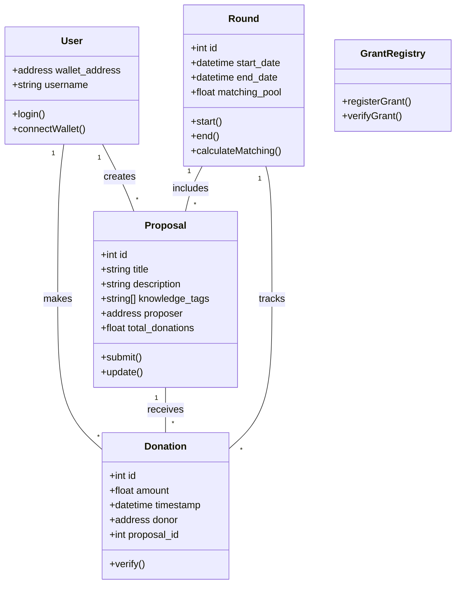
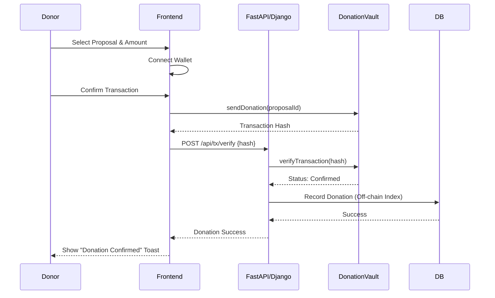
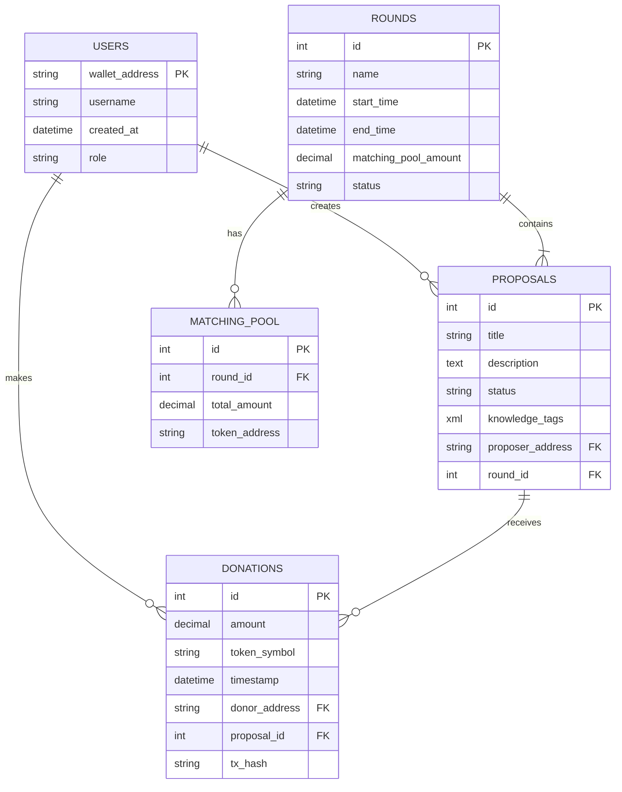

# Quadratic Funding DAO - System Design (SDF1)

## 1. Use Case Diagram
```mermaid
usecaseDiagram
    actor "Donor" as D
    actor "Proposer" as P
    actor "Admin" as A
    actor "System/Smart Contract" as S

    package "Quadratic Funding DAO" {
        usecase "Connect Wallet" as UC1
        usecase "Submit Proposal" as UC2
        usecase "View Proposals" as UC3
        usecase "Donate to Proposal" as UC4
        usecase "Create Funding Round" as UC5
        usecase "Resolve Round" as UC6
        usecase "Claim Funds" as UC7
        usecase "Manage Knowledge Tags" as UC8
    }

    D --> UC1
    D --> UC3
    D --> UC4
    P --> UC1
    P --> UC2
    P --> UC7
    A --> UC1
    A --> UC5
    A --> UC6
    A --> UC8
    
    UC4 ..> S : "Record Donation"
    UC6 ..> S : "Calculate Matching"
```

## 2. Class Diagram


## 3. Sequence Diagram (Donation Flow)


## 4. Activity Diagram (Round Lifecycle)
```mermaid
activityDiagram
    start
    :Admin creates Round;
    :Set Matching Pool & Dates;
    if (Date >= Start Date?) then (yes)
        :Round Active;
        fork
            :Accept Proposals;
        fork again
            :Accept Donations;
            :Calculate Quadratic Match;
        end fork
        if (Date > End Date?) then (yes)
            :Round Ended;
            :Admin calls Resolve();
            :Calculate Final Distribution;
            :Distribute Funds;
            stop
        else (no)
            :Continue;
        endif
    else (no)
        :Pending Start;
    endif
```

## 5. Entity Relationship Diagram (ERD)

